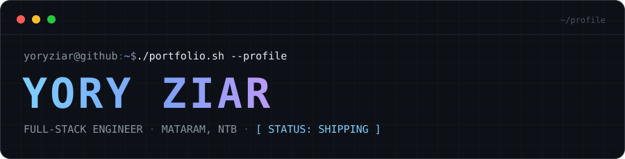

<div align="center">

<picture>
  <source media="(prefers-color-scheme: light)" srcset="./assets/wordmark-light.svg" />
  
</picture>

`📡 STATUS: ONLINE` &nbsp;·&nbsp; `🛠️ ARTEFAK: NOL DEPENDENSI EKSTERNAL` &nbsp;·&nbsp; `🌸 PENJAGA: NANAMI`

</div>

---

## `> whoami`

<pre>
╔═══════════════════════════════════════════════════════════════════════════╗
║  NAMA       : Yory Ziar                                                   ║
║  PERAN      : Full-Stack Engineer                                         ║
║  LOKASI     : Mataram, Nusa Tenggara Barat, Indonesia                     ║
║  FOKUS      : TypeScript · Next.js · Laravel · Tailwind CSS               ║
║  BASE       : Node.js · React · Vue · Astro · PHP                         ║
║  SIFAT KODE : Cepat, terstruktur, dapat dirawat                           ║
║  STATUS     : Building ──► Learning ──► Shipping                          ║
║  MAID_AI    : Nanami (Tactical System Maid 🌸)                            ║
║  SEJAK      : 17 Agustus 2022 · 5 tahun aktif                             ║
╚═══════════════════════════════════════════════════════════════════════════╝
</pre>

Saya membangun aplikasi web yang **cepat, andal, dan menyenangkan dipakai** — mulai dari antarmuka yang presisi, arsitektur backend yang rapi, hingga automasi yang menghilangkan pekerjaan berulang. Setiap baris ditulis untuk dibaca manusia lain, bukan hanya mesin.

Setiap paket kerja melewati satu jalur tetap: **rencana → implementasi → verifikasi build → tinjauan → rilis**. Dokumentasi ditulis dalam Bahasa Indonesia, dan performa diuji sebelum digadang-gadang.

---

## `> cat /proc/skills`

<pre>
┌───────────────────────────────────────────────────────────────────────────┐
│  [■■■■■■■■■■]  FRONTEND      React · Vue · Astro · Next.js · Tailwind     │
│  [■■■■■■■■··]  BAHASA        TypeScript · JavaScript · PHP · Python       │
│  [■■■■■■■···]  BACKEND       Laravel · Express · Sequelize · Node.js      │
│  [■■■■■■····]  BASIS DATA    PostgreSQL · MySQL · Neon · Appwrite        │
│  [■■■■■·····]  DEVOPS        Git · GitHub Actions · Podman · Vercel      │
│  [■■■■■·····]  MOBILE        Kotlin · Android SDK                        │
│  [■■■■······]  AUTOMASI      CrewAI · LLM Orchestration · AI Agents      │
└───────────────────────────────────────────────────────────────────────────┘
</pre>

---

## `> quest --active`

| Kode | Misi | Peran | Kondisi |
|:---:|---|---|:---:|
| `Q-01` | Ruang kerja agen AI spasial 3D — kendali otonom via Three.js | Arsitek & Pengembang | `AKTIF` |
| `Q-02` | Portal komunitas: direktori anggota, acara, katalog, panel admin | Pemilik Produk | `AKTIF` |
| `Q-03` | Mesin kompresi citra sisi klien — Canvas & Web Worker | Pemelihara | `AKTIF` |
| `Q-04` | Halaman penahan rilis bergaya sibernetik | Pengembang | `SIAP` |
| `Q-05` | Blog teknis performa tinggi dengan Astro + Sanity | Penulis | `RILIS` |

<sub>`status: AKTIF = sedang digarap · SIAP = selesai, menunggu rilis · RILIS = sudah tayang`</sub>

---

## `> ls /projects --sort=impact`

<details open>
<summary><b>⚡ pixel-compress</b> &nbsp;<code>TypeScript</code></summary>

**PixelCompress — Mesin Citra & Konverter Format Sisi Klien.** Kompresi, ubah ukuran, dan konversi format gambar (JPEG/PNG/WebP/AVIF/PDF) **100% di dalam peramban** melalui Canvas dan Web Worker — berkas tidak pernah menyentuh server. Mendukung pemrosesan batch, pengurutan ulang via geser, dan persistensi IndexedDB.

`Stack:` React 19 · TypeScript · Vite · Tailwind CSS
`Pranala:` [github.com/YoryZiar/pixel-compress](https://github.com/YoryZiar/pixel-compress)

</details>

<details open>
<summary><b>⚔️ leveling-system</b> &nbsp;<code>Vue</code></summary>

**Sistem Naik Level Harian.** Aplikasi gamifikasi latihan fisik dengan nuansa *Solo Leveling*: quest harian, pertumbuhan atribut, pembukaan kemampuan pemburu, serta papan peringkat global. Disiplin diubah menjadi mekanika permainan.

`Stack:` Vue.js · TypeScript
`Pranala:` [leveling-system.yoryziar.web.id](https://leveling-system.yoryziar.web.id) · [Sumber](https://github.com/YoryZiar/leveling-system)

</details>

<details>
<summary><b>📝 e-cbt</b> &nbsp;<code>Next.js</code></summary>

**Platform Computer-Based Testing.** Sistem ujian berbasis komputer yang modern, aman, dan responsif dengan integrasi backend Appwrite.

`Stack:` Next.js 16 · TypeScript · Tailwind CSS · Appwrite
`Pranala:` [e-cbt.vercel.app](https://e-cbt.vercel.app) · [Sumber](https://github.com/YoryZiar/e-cbt)

</details>

<details>
<summary><b>🤖 whatsapp-auto-replier</b> &nbsp;<code>Kotlin</code></summary>

**Balasan Otomatis WhatsApp.** Aplikasi Android native yang menanggapi notifikasi WhatsApp secara otomatis, dilengkapi penerapan otomatis melalui ADB.

`Stack:` Kotlin · Android SDK · Gradle
`Pranala:` [github.com/YoryZiar/whatsapp-auto-replier](https://github.com/YoryZiar/whatsapp-auto-replier)

</details>

---

## `> git stats --global`

<pre>
┌─ KONTRIBUSI PER TAHUN ────────────────────────────────────────────────────┐
│  2022  █·······················      1                                    │
│  2023  ██······················     26                                    │
│  2024  █████···················     75                                    │
│  2025  ████████················    120                                    │
│  2026  ████████████████████████    367   ◄ permintaan tertinggi           │
└───────────────────────────────────────────────────────────────────────────┘

┌─ KOMPOSISI KODE (14 repositori publik · 1,01 MB) ─────────────────────────┐
│  TypeScript  █████████████·······  64.8%                                  │
│  PHP         ██··················  10.4%                                  │
│  HTML        █···················   7.1%                                  │
│  JavaScript  █···················   6.0%                                  │
│  Vue         █···················   5.1%                                  │
│  Kotlin      █···················   5.0%                                  │
│  CSS         █···················   1.1%                                  │
│  EJS         █···················   0.5%                                  │
└───────────────────────────────────────────────────────────────────────────┘

┌─ IRAMA 12 BULAN TERAKHIR ─────────────────────────────────────────────────┐
│  Okt ██··················  10                                             │
│  Nov ····················   0                                             │
│  Des █···················   3                                             │
│  Jan ····················   0                                             │
│  Feb ████················  26                                             │
│  Mar █████···············  33                                             │
│  Apr ██··················  11                                             │
│  Mei ███·················  19                                             │
│  Jun ███·················  22                                             │
│  Jul ████████████████████ 129   ◄ puncak produktivitas                    │
│  Agu ███████████·········  73                                             │
│  Sep ████████············  54                                             │
└───────────────────────────────────────────────────────────────────────────┘
</pre>

| Metrik | Nilai |
|---|:---:|
| Kontribusi (12 bulan) | **394** |
| Pull Request (12 bulan) | **13** |
| Repositori publik | **15** |
| Kode publik | **1,01 MB** |
| Tahun aktif | **2022 – 2026** |
| Pengikut | **10** |

---

## `> ping me`

<div align="center">

`🌐` [yoryziar.my.id](https://yoryziar.my.id) &nbsp;·&nbsp; `📧` [yoryziar@gmail.com](mailto:yoryziar@gmail.com) &nbsp;·&nbsp; `📸` [instagram.com/yoryziar.codes](https://instagram.com/yoryziar.codes) &nbsp;·&nbsp; `💻` [github.com/yoryziar](https://github.com/yoryziar)

</div>

<br />

<details>
<summary><sub><b>📄 Catatan Teknis — mengapa README ini tidak memakai badge</b></sub></summary>

<br />

<!-- stats-updated -->
`📅 Data statistik diperbarui otomatis: 11 September 2026 WITA · 589 kontribusi sepanjang masa`

Berikut hasil pemindaian nyata terhadap repositori ini, bukan klaim:

```bash
# semua berkas gambar yang dirender halaman ini
$ grep -oE '(src|srcset)="[^"]*"' README.md | sort -u
src="./assets/wordmark-dark.svg"
srcset="./assets/wordmark-light.svg"

# adakah gambar yang diambil dari domain luar?
$ grep -cE '(src|srcset)="https?://' README.md
0
```

| Pemeriksaan | Hasil |
|---|:---:|
| Berkas gambar dari domain luar | **0** |
| Badge dari layanan pihak ketiga | **0** |
| Permintaan jaringan eksternal saat halaman dimuat | **0** |
| Berkas grafis | **2** — SVG lokal di `assets/` |

README ini dirancang **mandiri sepenuhnya**. Angka statistik dibaca langsung dari GitHub GraphQL API dan dirender sebagai teks saat ini juga — bukan diambil dari layanan gambar yang bisa mati sewaktu-waktu. Satu-satunya berkas grafis adalah SVG wordmark di `assets/`, tersimpan di dalam repositori ini sendiri dan beradaptasi otomatis terhadap mode terang maupun gelap GitHub.

Seluruh angka pada seksi `git stats --global` **diperbarui otomatis setiap Senin 01:00 WITA** oleh alur kerja di `.github/workflows/update-stats.yml`, yang membaca ulang data publik melalui `scripts/update_stats.py`. Karena itu tidak ada angka yang dapat menjadi usang tanpa terlihat.

Artinya: tidak ada *badge* usang, tidak ada gambar rusak, tidak ada permintaan jaringan ke domain luar. Halaman ini akan tampil utuh selama GitHub menampilkan Markdown.

</details>

---

<p align="center"><sub>Yory Ziar · Terminal portfolio v2.0 — dirawat dengan presisi oleh <a href="https://github.com/YoryZiar">Nanami 🌸</a></sub></p>
